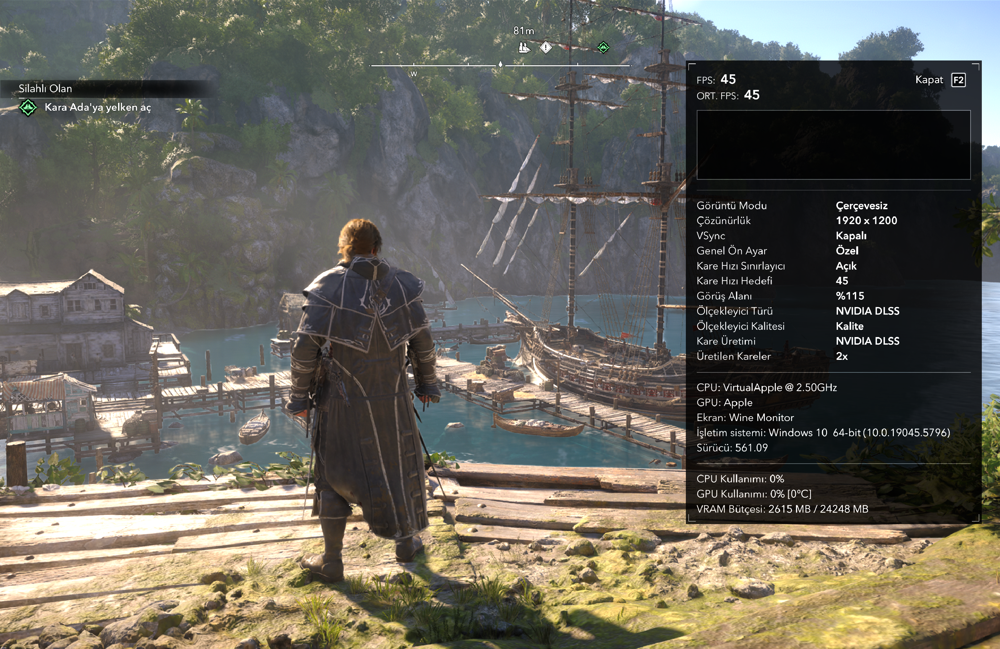

# GornHub Black Flag Compatibility

## One Week of Play — 14 Hours, RTX On, 40–45 FPS

**One week of play, 14 hours played, approximately 40–45 FPS average** during gameplay on an Apple M5 / 16 GB MacBook Pro. Ray tracing is enabled. The current saved resolution selector is **1920×1200**, with a **45 FPS limit**, **HDR off**, and the in-game **DLSS Quality / 2× frame-generation selections** enabled through the local MetalFX compatibility setup. The 2× selection is not a measured doubling claim.

**[Complete current settings and runtime details](docs/RECOMMENDED-SETTINGS.md)** · **[Exact active INI](settings/2026-09-19/ACBlackFlag.ini)**

Settings captured 19 September 2026. The playtime/FPS figures describe regular gameplay rather than a controlled benchmark; the downloadable release now includes the same **v6 module, MetalFX launch configuration, frame-generation capability proxy and Game Mode supervisor** used for this play report. The installer applies the complete captured settings and prepares the bridge from separately supplied dependencies.

### Current State of the Game

Captured 19 September 2026: 1920×1200, DLSS Quality and the 2× frame-generation selection, with the in-game counter showing **45 FPS / 45 average FPS**.

A targeted macOS runtime repair that took **Assassin’s Creed Black Flag Resynced** from audio behind a black screen to working local gameplay on Apple Silicon, with readable menus/subtitles and working SDR/HDR pause screens.

Developed for GornHub on 7–10 September 2026. This repository contains our Objective-C/Metal source, the **tested compiled mod**, launch adapters, selected measurements and an illustrated English engineering report.

## What it does

The observed D3DMetal path skipped color attachment setup for some pipelines. Missing target formats, blending and channel write masks produced black output, broken text and missing scene surfaces. The mod observes the original state and restores it when binding raster and mesh pipelines against their actual render targets. A separate, narrowly matched workaround suppresses the corrupt pause overlay in SDR and HDR.

The graphics repair is a **macOS `.dylib` loaded into the Wine process**. The complete v6 setup also includes our separate Windows VERSION proxy for the frame-generation capability query. The preparation script places each component correctly. This depends on the existing Wine/Rosetta/D3DMetal stack; it does not turn the game into a native ARM build.

## Start here

- **[Install and use the mod](docs/INSTALLATION.md)** — prerequisites, exact locations, loading, checks and removal.
- **[Build and understand the code](docs/CODE.md)** — file map, build command and controlled tests.
- **[Full engineering case study](docs/CASE_STUDY.md)** — problem, investigation, mistakes, solution, screenshots and dated public compatibility comparison.
- **[Recommended settings](docs/RECOMMENDED-SETTINGS.md)** — the complete active configuration after one week of play: 14 hours, RTX on, 40–45 FPS during gameplay, and DLSS/MetalFX details.
- **[Evidence index](docs/EVIDENCE.md)** — what was measured and what the result does not establish.
- **[Compiled mod and source](platform/packages/black-flag/compatibility/v6/)** — `BlackFlagCompatibility.dylib` and its manifest.

## Tested configuration and scope

Apple M5, 16 GiB RAM; macOS 26.6.2 (25G83); x86-64 WineForge 0.6.0.4 under Rosetta; the Black Flag-specific **D3DMetal 4.0 beta 2 binary pinned in the manifest**. The tested game installation was v1.0.6. Opening gameplay, menus, subtitles and pause were confirmed by the player, including HDR. Full-campaign stability and performance across machines are unverified.

Internal offsets make the module renderer-build-specific. Packaged release: **v6**, matching the current local play setup. Exact original-state restoration covers color targets of any size; inferred fallbacks and pause suppression retain a 400–4096 by 200–2160 size gate. The island terrain fix was verified in gameplay at 2560×1600 High. See [release history](docs/CHANGELOG.md). This is not a general compatibility guarantee for other builds, resolutions, wrappers or games.

## Included and required separately

Included: our v6 mod source and compiled module, VERSION proxy source and compiled DLL, MetalFX runtime configuration, Game Mode supervisor, backup/restore preparation script, exact active INI, Python adapters, session helper/tests, screenshots and selected diagnostic evidence.

Obtain separately: the game, WineForge and its dependencies, Rosetta, Apple’s evaluation environment/D3DMetal, and any required accounts. No game executables/assets, Apple renderer binaries, account credentials, saves or full Wine prefixes are included. This repository is not a complete GornHub app installer.

## Credits

GornHub project: **eymnshln-max**.

Built on work by Wine/WineForge and Apple's Rosetta, Metal and D3DMetal teams. No affiliation or endorsement is implied. The report compares dated public evidence; it cannot establish unpublished work by other teams. No open-source license is granted by this repository.
