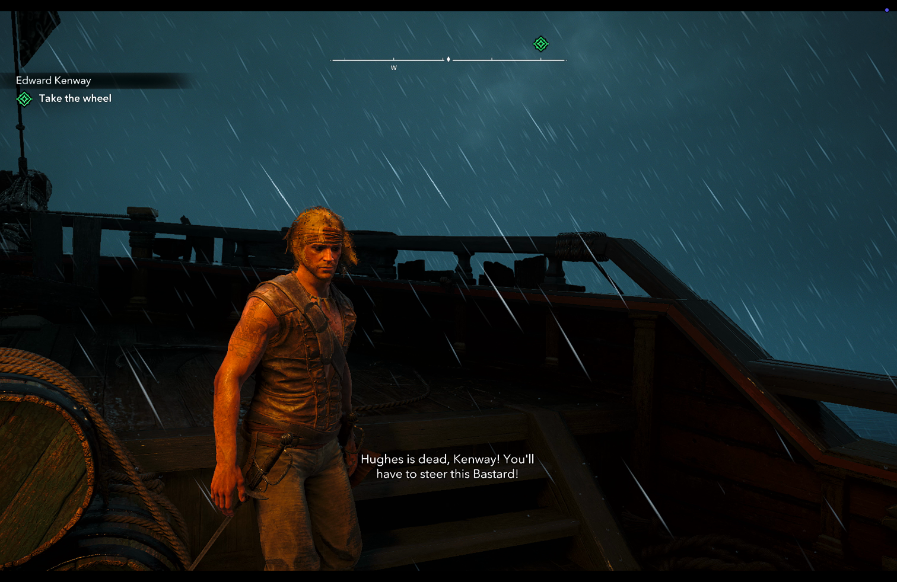
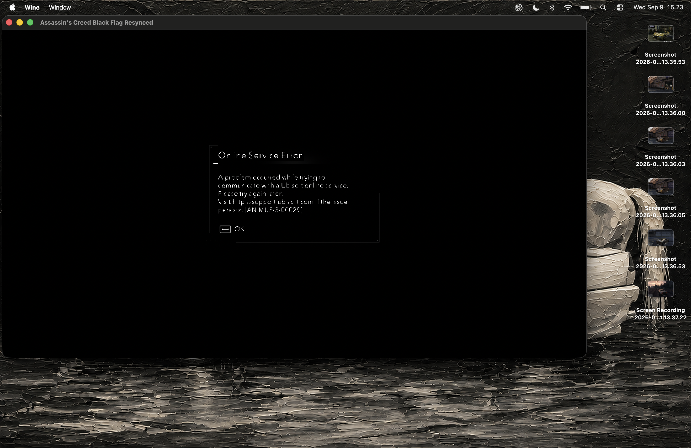
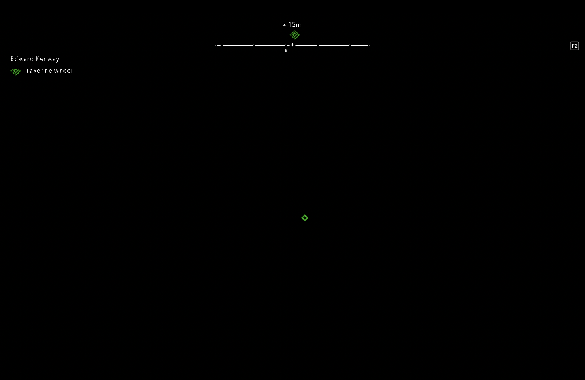
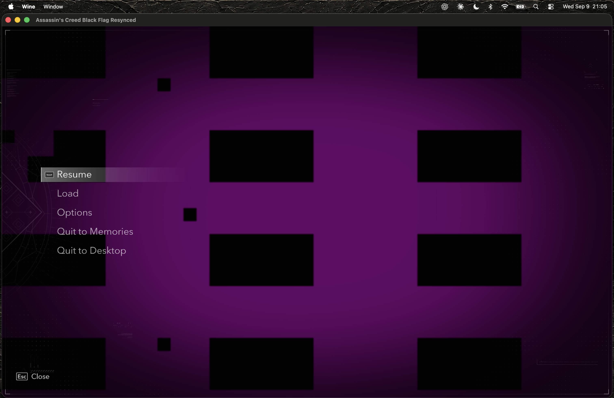
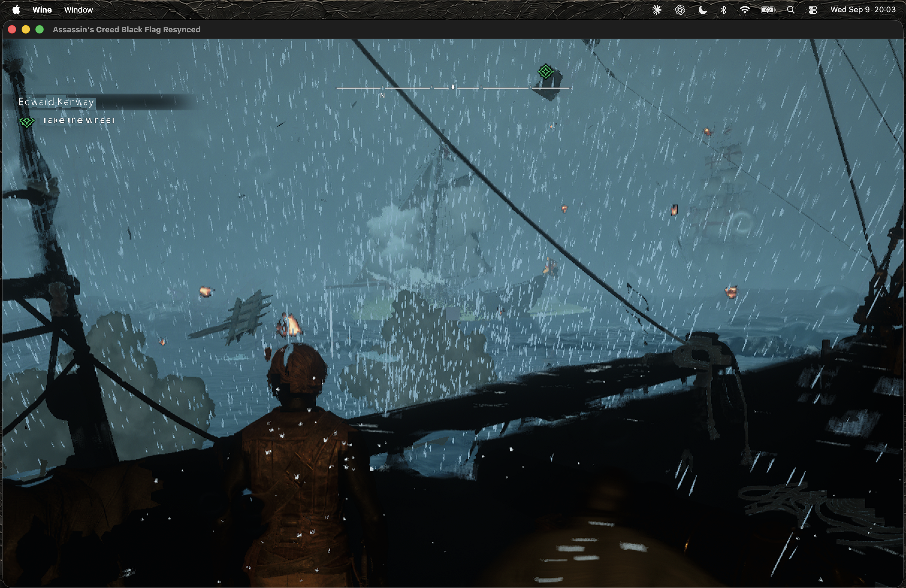
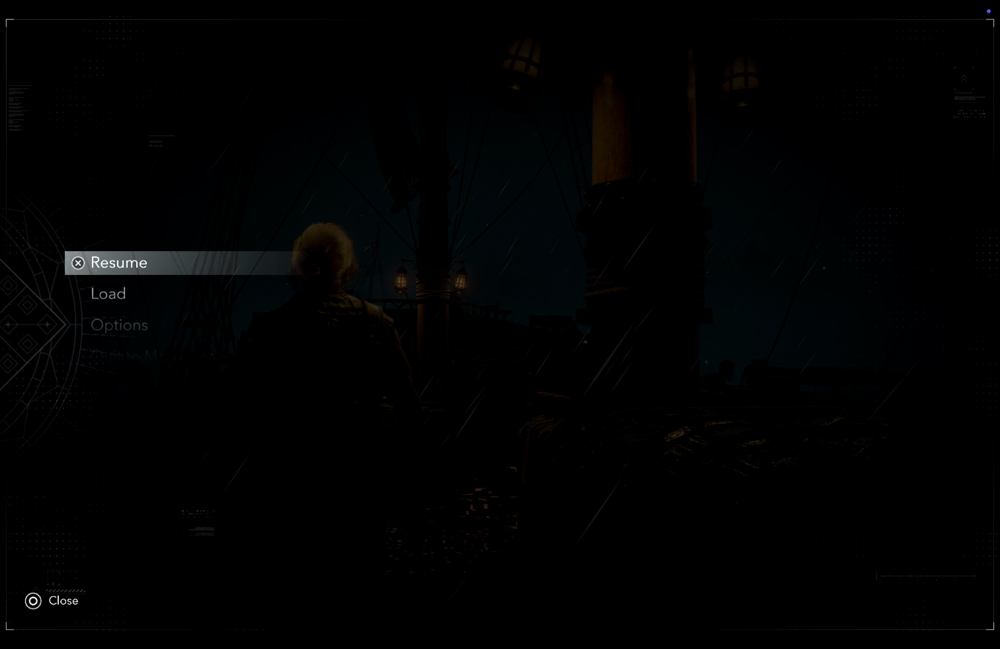
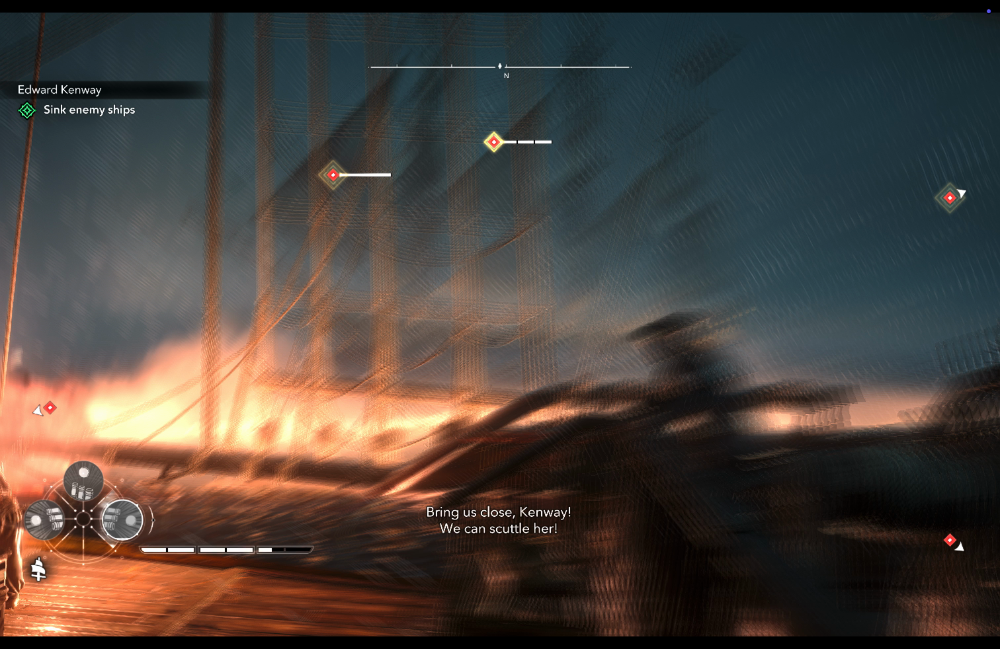

# Breaking the Black Screen

## How we made Assassin’s Creed Black Flag Resynced playable on Apple Silicon

**GornHub engineering case study · 7–10 September 2026**  
**Public compatibility review: 10 September 2026**  
**Project owner and hands-on tester: the GornHub creator · Implementation and investigation: Codex, with earlier diagnostic work from Claude**

We developed a working local Mac compatibility solution for Black Flag Resynced. We took an installed Windows game that produced sound behind a black screen, identified missing graphics pipeline state, wrote a targeted runtime repair, recovered readable menus and complete scene rendering in the tested gameplay, and resolved the remaining pink pause overlay in both SDR and HDR. We then packaged the repair into GornHub’s normal launch path.

**This is the first working local Apple Silicon solution identified in our review of the available public evidence on 10 September 2026.** The public CrossOver report we found had advanced past the initial DirectX error but still described audio with a black screen. Our result advances beyond that reported state to user-confirmed gameplay. This establishes our own engineering result and its evidence; it does not certify that no unpublished solution exists anywhere.

This was our repair, developed through tracing, controlled experiments and repeated player feedback—not a downloaded Black Flag graphics fix. It builds on substantial existing work by Wine/WineForge and Apple’s Rosetta, Metal and D3DMetal teams. We did not rebuild the entire game or write a replacement Windows operating system.



*Final session, 01:10: visible character, ship and scene. This is a frame from the user’s 10 September recording, not a generated illustration. The original full video is retained in the local project archive; selected frames are included here.*

## 1. What we achieved

| Area | Final evidence |
| --- | --- |
| Local Windows game execution on Apple Silicon | Running through the dedicated WineForge environment and BF-specific D3DMetal, with our compatibility module loaded |
| Opening interface and Animus Hub | User confirmed the menus recovered after earlier black and incomplete output |
| Text and subtitles | User explicitly confirmed glyphs and subtitles became correct |
| Character and world rendering | User confirmed the remaining tested gameplay defects cleared after original-state restoration covered raster and mesh pipelines |
| SDR pause screen | User confirmed pink blocks disappeared and the underlying game image returned |
| HDR pause screen | HDR initially reproduced the problem; the extended workaround was then confirmed correct with `HDREnabled=1` |
| Normal launch | Lean runtime confirmed in real use, without diagnostic recording or a timed shutdown |
| GornHub | Game profile installed; backend detected the live game and the launcher rejected a duplicate launch |

This is a playable local result on the tested machine and opening gameplay, not merely a successful process launch. It is not a full-campaign certification or a frame-rate benchmark. No controlled performance comparison with CrossOver was run.

## 2. Where CrossOver and other routes stood

The review deliberately separates native/local execution, compatibility wrappers and remote streaming. Playing a remotely rendered Windows game in a Mac browser is useful, but it does not solve local Apple Silicon graphics compatibility.

### CrossOver stable

CodeWeavers’ public changelog and download page listed **CrossOver 26.3.0**, released **21 July 2026**, as the latest stable version visible during this review. Its listed changes concern Diablo IV, Epic Games Launcher and GOG Galaxy; the changelog did not announce a Black Flag Resynced fix. The 26.0 release introduced Wine 11.0 and D3DMetal 3.0. This is the public stable history, not a claim about every later Preview build’s internal components. [CodeWeavers changelog](https://www.codeweavers.com/crossover/changelog), [download page](https://www.codeweavers.com/crossover/download-links/).

### CrossOver firsthand test reports

A launch-period MacGaming discussion contains firsthand failures on Apple Silicon, including an M4 Max with Tahoe and stable/Preview CrossOver reporting `DX12 Error 0x80070057`. Another participant described a splash screen, black output with music, and a pink screen before crashing. These are individual configurations, not an exhaustive compatibility matrix. [Original test discussion](https://www.reddit.com/r/macgaming/comments/1urk7bp/assassins_creed_black_flag_resynced_on_crossover/).

The more recent firsthand status post specifically names **CrossOver Preview 20260821**. Its author reports that the DX12 error is gone, but the game still produces sound without a visible image and remains unplayable in that test. That is the strongest directly relevant public comparison found in this review. [Preview status report](https://www.reddit.com/r/macgaming/comments/1w0uw3e/assassins_creed_black_flag_resynced_status_update/).

The CodeWeavers compatibility index lists Resynced separately from the original 2013 Black Flag. The individual Resynced page did not load through our research access, so we do not invent a rating from the index’s star placeholders. A forum index also contains a user diagnosis mentioning DirectStorage/IoRing; the index alone cannot establish that diagnosis. [Compatibility index](https://www.codeweavers.com/compatibility/?curPos=1550), [forum listing](https://www.codeweavers.com/support/forums/general?t=27%3Bmsg%3D356336).

### ARM64 Preview is a separate development track

CodeWeavers’ **31 July 2026** ARM64 announcement describes its initial Mac ARM64/FEX builds and explicitly lists the absence of D3DMetal and forthcoming D3D12 support at that time. It also describes an updated Intel build. That dated announcement is not proof that September builds retain all those limitations, and ARM64 Wine should not be confused with a native ARM64 build of this game. [CodeWeavers ARM64 announcement](https://www.codeweavers.com/blog/mjohnson/2026/7/31/crossover-preview-the-right-to-bear-arm64-on-mac).

### Other routes

| Route | What the review establishes |
| --- | --- |
| Other Mac Wine/GPTK wrappers, including searches for Whisky and WineForge | No earlier working Resynced-specific local graphics repair was identified in the reviewed results. An absence in this search is not a test of every wrapper. |
| Apple Game Porting Toolkit | Apple documents evaluating Windows executables and inspecting them with Metal tools. Our repair uses this existing translation foundation; Apple’s general capabilities page is not a promise that this title works unchanged. |
| Linux/Proton | Upstream issue #9958 reports a Ubisoft-banner startup problem on Linux and a proposed debugger/timing workaround. That report is about a different platform and symptom; it is not the Mac graphics solution. |
| GeForce NOW | NVIDIA officially listed Resynced for Steam and Ubisoft Connect in July. This provides a remote-streaming route, distinct from the local rendering result documented here. |

Sources: [Apple GPTK](https://developer.apple.com/games/game-porting-toolkit/), [Valve Proton issue #9958](https://github.com/ValveSoftware/Proton/issues/9958), [NVIDIA July games announcement](https://blogs.nvidia.com/blog/geforce-now-thursday-july-2026-games-list/).

The searches covered the exact Resynced title with CrossOver, Mac, playable, working, WineForge, Whisky, GPTK, AppleGamingWiki and September terms. We checked apparent success hits in context: one search snippet mentioning both Resynced and a Mac Studio turned out to describe **Factory Town 2** on the Mac. We also excluded the original Black Flag, native Shadows, cloud playback and articles that merely repeated the same Reddit report. [Context of the Mac Studio comment](https://www.reddit.com/r/SteamDeck/comments/1v0g95y/what_are_you_playing_this_week_megathread/).

## 3. The machine and the architecture

| Component | Recorded configuration |
| --- | --- |
| Processor / GPU family | Apple M5 |
| Unified memory | 16 GiB (`17,179,869,184` bytes) |
| macOS | 26.6.2, build 25G83; checked during documentation |
| Windows compatibility runtime | Wine 11.17, WineForge 0.6.0.4; checked during documentation |
| Graphics translation | Dedicated Black Flag D3DMetal 4.0 beta 2 |
| CPU instruction path | x86_64 runtime under Rosetta; `ROSETTA_ADVERTISE_AVX=1` in the game-specific environment |
| Final repair | `BlackFlagCompatibility.dylib`, compatibility package v2 |
| Integration | GornHub profile and detached Python launch adapter |
| Game package | The installed Resynced Windows package, described in installation records as v1.0.6; portability to other distributions/updates has not been established |

The execution path is:

```text
Windows game executable
    ├── CPU / Windows services → Rosetta + WineForge
    └── Direct3D graphics → BF-specific D3DMetal
                                ↓
                      Metal pipeline construction
                                ↓
                  Our scoped compatibility hooks
                  recover omitted attachment state
                                ↓
                        Apple GPU → display

GornHub → preflight + duplicate check → detached game launch
```

The repair operates on graphics objects inside the game process. It neither changes the game’s movement/story logic nor recompiles its source code. No game source repository was available. Our final graphics solution does not modify the game executable or D3DMetal binary on disk; it observes and replaces selected in-process pipeline objects.

The installed package’s launch/authentication arrangement is separate from this graphics work. This report documents neither a DRM method nor proof that every storefront build behaves identically.

## 4. How the investigation progressed

### Phase A — clear the startup gates

Installation records report 249 required files passing MD5 verification. This established installed-file integrity against that package’s checklist, not rendering correctness.

The first launch stopped at an AVX2 requirement. The game-specific runtime was configured to advertise Rosetta’s supported AVX capabilities using `ROSETTA_ADVERTISE_AVX=1`, following the bundled Apple guidance recorded in the handoff. The next launch advanced into graphics initialization.

The project then encountered `0x80070057` in the placed-resource path. Earlier disassembly and live instrumentation recorded a D3DMetal 4.0b1 rejection of a 2,000-byte buffer. Moving **only Black Flag** to 4.0b2 removed that observed initialization failure. The shared GTA renderer remained unchanged. This cleared a gate; it did not yet produce a working game image.

### Phase B — a running game behind a black screen

Audio, mouse responses and later player navigation established that the process could reach menus, cutscenes and gameplay. The visible image remained black or mostly empty. The owner repeatedly identified the actual phase—Press Any Key, Animus Hub, cutscene or gameplay—so we could stop treating every noisy frame as the same state.

Several early interpretations failed. Non-black pixels were mistaken for a rendered scene. A contact sheet of arbitrary live textures was mistaken for evidence of corrupted texture uploads. A short capture containing only the final display copy was mistaken for proof that the game had no scene draws. These were measurement and reasoning errors, and they are part of this project’s history.

### Phase C — make the measurements trustworthy

We corrected the readback tools before relying on them. Pixel-format 92 required packed floating-point decoding; format 115 required half-float decoding. Unknown formats could no longer silently fall back to arbitrary RGB bytes. Magenta in one preview tool meant **NaN/Inf visualization**, not a proven missing-texture marker.

The larger correction was timing. A texture retained as an object may still reference heap memory reused by another resource. Reading it seconds later can produce unrelated contents. We moved toward operation-level captures with explicit ordering, completion checks and tests that deliberately reused an aliased heap allocation. Known-pattern tests for formats 70, 92 and 115 matched source and destination bytes in those controlled cases. That validated the reader’s covered paths, not the whole game.

We also corrected method coverage. Finding a selector in a binary did not prove execution; creating a Metal 4 object in a probe did not prove the game used it. Positive controls and actual class discovery eventually identified substantial game uploads through the Metal 3 blit path. The earlier zero-hit Metal 4 probe was not a measurement of those uploads. [Readback validation record](evidence/readback-validation.md).

### Phase D — follow actual writers, then recover the first interface

Instead of assuming a shader’s role from its name, the later investigation followed live resource identities and writer boundaries. The final display copy reproduced its source; the missing useful image existed earlier in the chain. UI writers included `PS_Phoenix` pipelines with invalid color attachment formats.

On 9 September, repairing a narrowly identified invalid UI target format produced the first recognizable service dialog and then the Animus Hub. This was a causal improvement in visible output, but letters were incomplete and the world remained absent.



*9 September, first UI recovery. The connection dialog became visible, with incomplete glyphs. Its appearance did not prove the graphics change caused a new network failure.*



*A later gameplay screenshot showed a readable-enough HUD over an absent world. Interface recovery was a checkpoint, not the endpoint.*

### Phase E — formats alone were not enough

We derived missing formats from the render pass’s actual attachments at pipeline bind time. More scene content appeared, but text and geometry were still visibly wrong. This demonstrated that format repair addressed part of the failure while leaving other color state incomplete.

A subsequent experiment used a unique existing color-state template from the **same retained vertex and fragment function objects**, with matching formats and other pipeline conditions. Ambiguous templates were rejected. This recovered glyphs and subtitles; extending it to additional raster paths improved the character and world.



*Readable pause-menu text over the still-corrupt background. Text and overlay defects were now visibly separable.*



*An intermediate gameplay frame from 9 September: real scene content, but substantial surface defects. The final implementation replaced reliance on inferred templates with each pipeline’s own source state wherever it could be recovered.*

### Phase F — recover the pipeline’s own original state

The decisive step was inspecting D3DMetal’s attachment-construction code and recovering the original state before it was omitted. This made the repair principled: use the affected pipeline’s own intended blending and write masks, plus the actual target formats at bind time.

We validated the decoder against 30,612 eligible source/native attachment pairs with **zero mismatches** in the recorded comparison. The same run identified **419 bound pipelines** with positive target counts but zero packed formats. Those cases followed the observed skip path described in the next section.

Raster restoration improved the scene. Extending the same own-state recovery to **mesh pipeline creation** addressed additional world surfaces that the earlier raster-only implementation had missed. The user subsequently confirmed the other gameplay defects were fixed, leaving the pause overlay as a separate problem. [Source comparison evidence](evidence/source-analysis.json).

### Phase G — isolate and suppress the corrupt overlay

Same-command-buffer before/after captures localized the pause corruption: the scene was coherent after temporal processing and remained coherent after one shading step. The following matching `PS_ShadePixel` draw transformed it into the magenta checker pattern. The next temporal pass again yielded a coherent scene.

This supplied a precise intervention point. We disabled color writes for the narrow observed overlay signature, preserving the scene beneath it. SDR pause was then user-confirmed correct.

The user enabled HDR and immediately exposed a gap: the same overlay now targeted format 115 rather than 70. A new capture established the same relevant state and shader pairing in the HDR target. Extending the format gate to include 115, while keeping the other restrictions, passed the HDR control and the user’s real-game check.



*Final recording, 01:05: the pause menu over the preserved game scene, without the earlier pink checker overlay. The dim background is shown as recorded, without brightness enhancement.*

### Phase H — turn the experiment into normal use

We extracted the successful hooks into a lean module. Diagnostic framebuffer dumps, capture controls, frequent logs and the experimental timeout were removed from the normal path. The launcher checks pinned file hashes, prevents duplicate starts and leaves the game running independently of the initiating command. The user confirmed both the lean SDR session and the later HDR correction.

## 5. The technical mechanism we repaired

### Missing color state at pipeline construction

In the pinned D3DMetal 4.0b2 build, the function identified as `SetupAttachmentDescriptor` is at image-relative offset `0x113813`. The observed construction logic skips a target’s format, blend and write-mask setters when its packed dynamic format byte is zero, or when its index is outside the static target count.

The critical distinction is that **an absent format did not only leave an absent format**. It also prevented associated color state from reaching the native descriptor. Repairing formats alone could therefore expose a scene while still applying unsuitable default blending or channel writes.

The decoder observes the `colorAttachments` getter at two caller return addresses: `0x112ec6` for the standard raster path and `0x113265` for the mesh path. An earlier note reversed these labels; the final code covers both addresses and this report uses the corrected labels.

The recorded x86_64 caller layout is:

| Item | Location in this exact build |
| --- | --- |
| Owner pointer | caller stack + `0x28` |
| Eight packed format bytes | caller stack + `0x30` |
| Static state block | owner + `0x70` |
| Target count | static block + `0x255` |
| Eight 12-byte color records | static block + `0x258` |

Each color record yields blending enablement, source/destination RGB factors, RGB operation, source/destination alpha factors, alpha operation and write mask. Bounds and enum checks reject unsupported state. A standalone caller-stack fixture exercised the actual Objective-C hook path, rather than validating only an unrelated byte parser.

The bind-time repair follows this sequence:

1. Require an eligible recorded pipeline whose original color formats and recorded packed formats are all zero.
2. Require a valid positive static color-target count, valid decoded state and actual render-pass formats.
3. Copy the original pipeline descriptor, retaining shader functions and non-color state.
4. Set color formats from the render pass’s real attachments.
5. Restore **that pipeline’s own** blend factors, operations and channel write masks; targets beyond its static count write no channels.
6. Create the appropriate raster or mesh variant and cache it for that source pipeline and target-format combination.
7. If recovery is ineligible or fails, retain the established fallback behavior rather than fabricating source state.

The evidence strongly ties omitted attachment state to the repaired symptoms. It does not establish why every upstream packed format was zero, nor that every D3DMetal game shares this path. The implementation solves the measured transfer problem without claiming to have reconstructed the entire proprietary renderer.

Relevant preserved source: [state observation](../platform/packages/black-flag/compatibility/v2/source_state.h), [decoder](../platform/packages/black-flag/compatibility/v2/source_state_decode.h), [raster/mesh recovery](../platform/packages/black-flag/compatibility/v2/source_restore_mesh.h), [lean module](../platform/packages/black-flag/compatibility/v2/compatibility.m).

### The separate SDR/HDR overlay workaround

The final overlay filter matches `VS_ShadeVertex` + `PS_ShadePixel`, a single color target in format **70 (RGBA8Unorm)** or **115 (RGBA16Float)**, no depth/stencil attachments, sample count one, enabled blending with factors 4/5 for both RGB and alpha, and a full color write mask. A cached descriptor variant sets the write mask to none.

The preserved underlying scene is the benefit. The omitted visual overlay is the tradeoff. This is a targeted workaround, not a repaired shader algorithm. Its signature uses shader names and state, not a cryptographic identity for the shader function, so another context with the same signature may also have its overlay omitted.

The positive control verified that a matching overlay preserved every one of 256 background pixels. A negative control with changed blend state still rendered normally. The HDR version used half-float pixels and also passed. Actual game confirmation then established that the intended symptom disappeared. [Overlay source](../platform/packages/black-flag/compatibility/v2/pause_overlay.h), [HDR control](../platform/packages/black-flag/compatibility/v2/hdr-control.m), [HDR capture metadata](evidence/hdr-pause-capture.json).

## 6. What the failed approaches taught us

| Earlier interpretation | Why it was insufficient | Method that replaced it |
| --- | --- | --- |
| “The image exists because the pixels are non-black.” | Nonzero data can be clears, noise, unrelated memory or a diagnostic visualization. | Inspect recognizable content and match the producing operation. |
| “Pink means the game has missing textures.” | One tool explicitly colored NaN/Inf magenta; later real pink output was a separate observation. | Keep preview conventions separate from actual presented pixels. |
| “The texture dump proves an upload-layout bug.” | Late reads of reused heap storage and incorrect format decoding could create the apparent corruption. | Validated decoding and captures ordered around actual operations. |
| “No hook events means no copies.” | The hook covered the wrong execution path or class. | Discover real classes, add positive controls and distinguish probe-created objects from game calls. |
| “One draw in the capture means the game renders nothing.” | The short capture showed final presentation, not necessarily the earlier scene producer. | Follow resource identity and scope each conclusion to captured work. |
| “The beach cinematic proves the 3D renderer works.” | The owner identified it as a video; successful video playback did not establish real-time world rendering. | Separate prerecorded content, menus, cutscenes and gameplay. |
| “Fix every missing format and we are done.” | Blending and write masks had also been skipped. | Recover original source state and cover both raster and mesh creation. |
| “SDR pause success proves HDR.” | HDR used another target format. | Reproduce with HDR enabled, capture the matching state, then extend and validate the filter. |

The owner’s contribution was central: challenging unsupported explanations, identifying the actual game state, supplying screenshots and recordings, noticing which defects changed, and catching the HDR regression after the apparently complete SDR result. The coding agents supplied instrumentation, code inspection, implementation and validation. Progress came from that feedback loop.

## 7. The final session, preserved



*Final session, 01:25: naval gameplay with visible ship, effects and HUD, including strong motion blur in this frame. This establishes displayed scene content at this moment; it is not a benchmark or a claim that every future effect has been tested.*

The full original recording (3 minutes 15 seconds) is retained in the local project archive, outside this Git repository.

The recording was supplied as `Screen Recording 2026-09-10 at 02.48.49.mov`: H.264, 3024×1964, duration 195.326667 seconds. A byte-preserving copy is retained in the local archive. The report’s extracted frames are downscaled for reading; their time positions are recorded. Some portions of the original recording are black during transitions; the full video is retained rather than edited into an uninterrupted success reel. It includes options, gameplay, naval action and transitions. The reviewed sample frames do not measure HDR luminance or frame pacing.

## 8. Reproducibility and the working package

The documentation folder includes a frozen copy of our v2 source, the relevant launch/session code, primary investigation notes, selected evidence and a checksum manifest. It intentionally does not copy the installed game, Apple’s renderer binaries or account/save data into this report package. The compatibility dylib remains in the working project; its exact checksum is preserved here.

The local launch adapter selects `platform/packages/black-flag/compatibility/v2`. Its preflight checks the module and renderer hashes before launching. The important identities are:

```text
BlackFlagCompatibility.dylib v2
50a2e7cf2a58f2f07a09662ffad8a44991fbf9a2d4bbd8ff4d9d5d99cd0b8acb

BF-specific D3DMetal 4.0b2
f5b56df1b8fe8b364dd9530651a3769c8aed948bd343be3b4510604d503e2bad
```

The offsets above depend on the latter binary. A different D3DMetal release requires fresh inspection and validation, not a blind offset reuse. The source snapshot is engineering documentation for this configured system, not a self-contained installer for arbitrary Macs.

The repair currently tracks render targets between **400–1600 pixels wide and 200–1000 pixels high** in the lean path. That reflects the tested setup. It is not a claim of universal 4K or arbitrary-resolution support. The intended next expansion would measure additional target sizes and pipeline paths while retaining the current verified checkpoint.

The launcher preserves user options, including HDR. It uses the dedicated Black Flag environment and leaves GTA’s working environment intact. Reverting to v1 is a rollback to the confirmed SDR configuration; HDR pause requires v2. [Package manifest](../platform/packages/black-flag/compatibility/v2/manifest.json), [launcher](../platform/tools/black_flag.py), [runtime environment](../platform/tools/black_flag_runtime.py).

## 9. GornHub integration

The game has a separate library profile, read-only preflight and detached launch action. Process status is scoped to the Black Flag environment. Duplicate launch detection was exercised while the game was open.

During HDR testing, Wine could re-execute the game with only `ACBlackFlag.exe` as its process name. The shared lifecycle helper was extended to recognize that case only when the resolved working directory lies inside the environment’s C drive and contains the matching executable. Regression cases cover outside-prefix paths, absent files and symlink escapes. All 17 lifecycle tests passed. The updated app helpers were installed and their signatures verified.

The live backend reported the exact game process as running. A real GornHub stop was not invoked just to manufacture a verification result while the owner was playing; end-to-end click testing of that button remains distinct from backend and ownership tests. [Recorded integration checks](../platform/packages/black-flag/compatibility/v2/live-status-validation.json).

## 10. The result we can stand behind

We developed and demonstrated a local Apple Silicon graphics solution that moved Black Flag Resynced from black output to the tested working gameplay, readable interface and correct pause behavior in SDR and HDR. The missing-state repair is backed by source/native comparisons, scoped intervention and visible improvements. The final pause correction is backed by producer-boundary evidence and a deliberately narrow workaround.

The remaining validation work is broader coverage: longer sessions, later environments, additional resolutions, other Apple chips and other game builds. Those are future compatibility tests, not a reason to describe the completed result as merely “the game launches.”

**Our achievement is the working repair, its integration, and the documented path from failure to playable output.**

---

### Reading the evidence

Start with [the chronological investigation log](evidence/investigation-log.md). It is append-only history: earlier “pending,” “active” or causal claims must be interpreted alongside later corrections. The final sections supersede those intermediate states. [Readback validation](evidence/readback-validation.md) explains the measurement corrections; [source-analysis.json](evidence/source-analysis.json) contains the attachment comparison; [the source snapshot](../platform/packages/black-flag/compatibility/v2/README.md) identifies the final normal runtime. [Evidence index](EVIDENCE.md) maps the preserved material and capture provenance. The package manifest checks the delivered module and source files.
